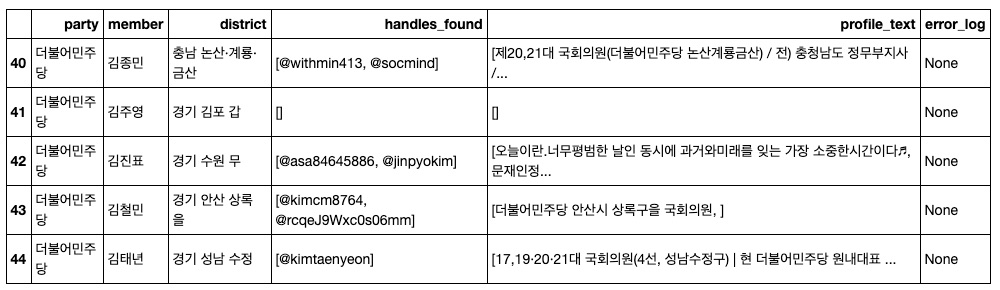
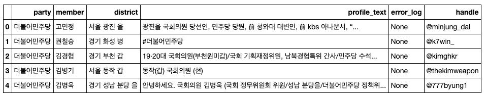

# twitter-scraper

Scraper that scrapes accounts through querying keywords on twitter. The scraper works in two steps: first, it scrapes handles by querying a query in twitter search page. Second, after obtaining the handles it accesses the account pages of the handle and scrapes meta data including the profile text.

The scripts run in Python 3.7. Please install the requirements:

selenium
multiprocessing

Also, you should have a chromedriver installed that matches the version of your chrome browser. Change the directory in `chromedriver_path.py`

## A single query example -- querying a name and obtaining handle

Use the script `twitter_scraper_beta_single.py`, change the fields in the execution line

```
if __name__ == '__main__':
    query_name = '이낙연'
    url = 'https://twitter.com/search?q=국회의원%20'+query_name+'&src=typed_query&f=user'
    output = run_sel(query_name,url)
```

The `output` you obtain by querying  the name `이낙연` yields:
```
output

{'query_name': '이낙연',
 'handles_found': ['@nylee21', '@100HyeRyun'],
 'error_log': None}
```

## Multiple query example -- querying handles of members of the 21st congress in South Korea

The example here is the usage of the scraper in finding accounts of members of the 21st congress in South Korea. Use the name catalogue saved as `21st_congress_names.json` in this repository.

The data set looks like this:

```
def open_json(filename):
    with open(filename) as f:
        output = json.load(f)
    return(output)

open_json("21st_congress_names.json")

[{'party': '국민의당', 'member': '권은희', 'district': '비례대표'},
 {'party': '국민의당', 'member': '이태규', 'district': '비례대표'},
 {'party': '국민의당', 'member': '최연숙', 'district': '비례대표'},
 {'party': '기본소득당', 'member': '용혜인', 'district': '비례대표'},
 {'party': '더불어민주당', 'member': '강득구', 'district': '경기 안양 만안'},
 {'party': '더불어민주당', 'member': '강병원', 'district': '서울 은평 을'},
 {'party': '더불어민주당', 'member': '강선우', 'district': '서울 강서 갑'}, ..
```
Use `twitter_scraper_beta_multiple.py` and define execution line as following:

```
if __name__ == '__main__':
    def open_json(filename):
        with open(filename) as f:
            output = json.load(f)
        return(output)

    member_dict_list = open_json("21st_congress_names.json") # load the .json file

    # use multiprocessing to iterate
    n = cpu_count()-1
    with Pool(n) as p:
        results = p.map(run_sel,member_dict_list)

    df = pd.DataFrame(results)
    print(df[40:45))
```


I examined the results and parsed the matching handles. The sorted list of handles and meta-data extracted are stored in `21st_congress_members_handles_final.json`.

```
import json
import pandas as pd

def open_json(filename):
    with open(filename) as f:
        output = json.load(f)
    return(output)

output_list = open_json("21st_congress_members_handles_final.json")
df = pd.DataFrame(output_list)
df.head()
```


